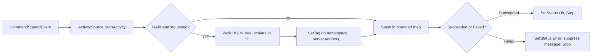

# Tokuro.OpenTelemetry.Instrumentation.MongoDB

OpenTelemetry instrumentation for the official `MongoDB.Driver` (3.x). PII-safe by default, dual-writes legacy and stable OTel DB semantic conventions, and bounds its in-flight activity map so a leaky cursor cannot exhaust process memory.

[](https://www.nuget.org/packages/Tokuro.OpenTelemetry.Instrumentation.MongoDB)
[](https://www.nuget.org/packages/Tokuro.OpenTelemetry.Instrumentation.MongoDB)
[](https://github.com/<OWNER>/Tokuro.OpenTelemetry.Instrumentation.MongoDB/actions/workflows/ci.yml)
[](./LICENSE)
[](https://dotnet.microsoft.com/)

## Quick example

```csharp
using OpenTelemetry.Trace;

builder.Services.AddOpenTelemetry()
    .WithTracing(t => t
        .AddMongoDBInstrumentation()
        .AddOtlpExporter());
```

That's it. Every command issued by every `MongoClient` in the process emits a span with redacted BSON, `db.system.name = "mongodb"`, `db.namespace`, `server.address`, and `server.port`. No connection strings, no document payloads, no exception bodies.

## Why this library

Production-tested gap-fill over `MongoDB.Driver.Core.Extensions.DiagnosticSources` v3.0.0:

- **PII-safe redaction by default.** The BSON tree is walked; every scalar becomes `"?"`. Collection names, operators, and structure are preserved. Raw capture is opt-in, not opt-out.
- **`exception.message` suppressed on failed commands.** MongoDB driver exceptions echo BSON fragments (E11000 duplicate-key errors carry the conflicting document, schema validation surfaces the rejected payload, bulk-write rejects include rows). Off by default.
- **Dual-write OTel DB semantic conventions.** Emits both legacy (`db.system`, `db.statement`, `db.name`) and stable (`db.system.name`, `db.query.text`, `db.namespace`) attributes during the OTel sem-conv migration window.
- **Bounded in-flight Activity map.** Struct dictionary key, configurable eviction cap. Upstream uses an unbounded `ConcurrentDictionary<int, Activity>` — a leaky long-running cursor or a flood of unmatched `getMore`s grows the heap forever.

## Installation

```bash
dotnet add package Tokuro.OpenTelemetry.Instrumentation.MongoDB
```

## Usage

### With OpenTelemetry's `TracerProviderBuilder` (recommended)

```csharp
builder.Services.AddOpenTelemetry()
    .WithTracing(t => t
        .AddMongoDBInstrumentation(options =>
        {
            options.CaptureCommandText        = true;
            options.SuppressExceptionMessage  = true;
            options.MaxCommandTextLength      = 4_000;
            options.MaxInFlightCommands       = 10_000;
            options.EmitLegacyAttributes      = true;
            options.EmitStableAttributes      = true;
            options.FilterCommand             = e => e.CommandName != "ping";
        })
        .AddOtlpExporter());
```

The DI-based registration discovers every `MongoClient` resolved through the container and wires the instrumentation into its `ClusterConfigurator`.

### With manual `MongoClientSettings` construction

If you build `MongoClient` outside DI (legacy code, console apps, tests):

```csharp
var settings = MongoClientSettings.FromConnectionString(cs);
settings.AddOpenTelemetryInstrumentation(); // or pass an options lambda
var client = new MongoClient(settings);
```

Same instrumentation surface, no DI requirement.

### Backend interop

Spans are vendor-neutral OTel. Shipping to Datadog via the DD Agent or DDOT, the agent's DB service-splitting automatically surfaces these spans under `service:<svc>-mongodb` thanks to the `db.system.name` attribute. Tempo, Honeycomb, Jaeger, New Relic, and Grafana Cloud OTLP all consume the same payload without backend-specific configuration.

## Configuration

| Option                       | Default                                     | Meaning                                                                                                  |
| ---------------------------- | ------------------------------------------- | -------------------------------------------------------------------------------------------------------- |
| `CaptureCommandText`         | `true`                                      | Emit `db.statement` / `db.query.text` with the redacted BSON.                                            |
| `SuppressExceptionMessage`   | `true`                                      | Drop `exception.message` on failed commands; keep `error.type`.                                          |
| `MaxCommandTextLength`       | `4000`                                      | Truncate redacted command text beyond this many chars; suffix `...[truncated]`.                          |
| `MaxInFlightCommands`        | `10000`                                     | Defensive upper bound on the in-flight Activity map; on overflow, all in-flight entries are stopped and the map is cleared (not an LRU). |
| `EmitLegacyAttributes`       | `true`                                      | Emit pre-stable attrs (`db.system`, `db.statement`, `db.name`).                                          |
| `EmitStableAttributes`       | `true`                                      | Emit stable attrs (`db.system.name`, `db.query.text`, `db.namespace`).                                   |
| `FilterCommand`              | `null`                                      | Optional predicate over `CommandStartedEvent`. Return `false` to suppress the span entirely. When `null`, only the built-in handshake/heartbeat list is filtered. |

## Features comparison

| Capability                                  | This library            | `jbogard/MongoDB.Driver.Core.Extensions.DiagnosticSources` v3.0.0 |
| ------------------------------------------- | ----------------------- | ----------------------------------------------------------------- |
| BSON redaction default                      | On (scalars → `"?"`)    | Off — raw command captured                                        |
| Opt-in raw capture                          | Yes (`CaptureCommandText` + explicit unredacted toggle) | Default behavior, no opt-out                          |
| `exception.message` handling                | Suppressed by default   | Recorded raw (leaks BSON fragments)                               |
| OTel legacy attributes                      | Yes                     | Yes                                                               |
| OTel stable attributes (`db.system.name` …) | Yes                     | No                                                                |
| `server.address` / `server.port`            | Yes, low-64-bit-safe IP handling | Partial                                                  |
| Bounded in-flight map                       | Yes (`MaxInFlightCommands`)      | No — unbounded `ConcurrentDictionary<int, Activity>`     |
| Struct dictionary key                       | Yes (no boxing)         | No                                                                |
| TFMs                                        | `net8.0;net9.0;net10.0` | `net6.0;net8.0`                                                   |

## How it works

The instrumentation subscribes to the MongoDB driver's command-monitoring events via a `ClusterConfigurator`. On `CommandStartedEvent`, an `Activity` is started (cheap when no listener is registered) and stashed in a bounded map keyed by request id. On `CommandSucceededEvent` / `CommandFailedEvent`, the activity is retrieved, tagged, and stopped.



The hot path is gated on `Activity.IsAllDataRequested`. Sampled-out commands incur only a dictionary insert + remove and one `Activity` allocation that the runtime can elide under tiered JIT.

## Caveats & known limitations

- **Aggregation pipelines are redacted structurally only.** Stage operators (`$match`, `$group`, …) are kept; user-supplied values are not. The shape of a pipeline is sometimes itself sensitive — review before enabling `CaptureCommandText` in shared-tenancy databases.
- **`getMore` cursor continuation is not correlated to the originating `find`.** The driver does not surface a parent request id. Each `getMore` is its own root span by design; correlate via cursor id if needed.
- **Bounded map overflow is a signal.** When the in-flight map reaches `MaxInFlightCommands`, all currently-tracked activities are stopped and the map is cleared as a defensive cap (not an LRU eviction). A non-zero overflow event means either a misbehaving consumer (unmatched request ids) or a real leak.

## Performance

The hot path is gated on `Activity.IsAllDataRequested`. BenchmarkDotNet results live in [`bench/`](./bench/). The contract is: **no allocation regression on the steady-state sampled-out path** versus a no-op subscriber, measured on `net8.0` and `net10.0` with the tiered server GC.

## Compatibility

- `MongoDB.Driver` >= 3.0.0, < 4.0.0
- .NET 8, .NET 9, .NET 10
- OpenTelemetry SDK 1.9+

## Contributing

See [`CONTRIBUTING.md`](./CONTRIBUTING.md).

## Security

See [`SECURITY.md`](./SECURITY.md). **Do not file security issues publicly.**

## License

Apache-2.0. See [`LICENSE`](./LICENSE).

## Acknowledgements

Prior art: Jimmy Bogard's [`MongoDB.Driver.Core.Extensions.DiagnosticSources`](https://github.com/jbogard/MongoDB.Driver.Core.Extensions.DiagnosticSources). This library exists to cover gaps that surfaced during a production audit of that package — chiefly PII redaction defaults, exception-message suppression, dual sem-conv emission, and a bounded in-flight map. The shape of the public API is intentionally close to make migration mechanical; see [`docs/migration-from-jbogard.md`](./docs/migration-from-jbogard.md).
